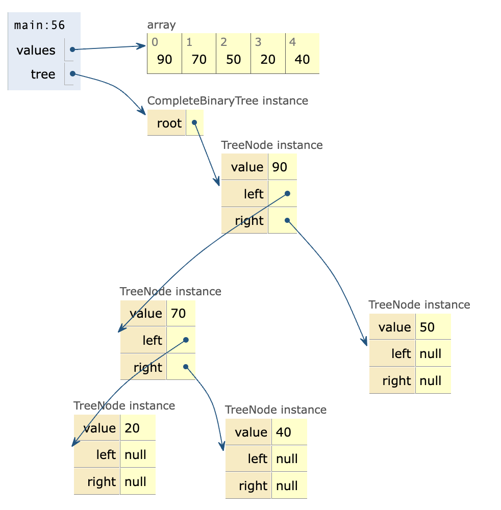

# CMSC 315 Project #3: Binary Trees

In this project, you'll work with various types of Binary Trees, including
Complete Binary Trees, Binary Heaps, and Binary Search Trees.

Let's review the similarities and differences between these tree structures.

---

### 1. **Binary Tree (General)**

A binary tree is a tree in which each node has at most two children. There are
no additional constraints.

#### Example:

```
       A
      / \
     B   C
        /
       D
```

- Node A has two children (B and C).
- Node C has one child (D).
- No rules about ordering or completeness are followed.

---

### 2. **Complete Binary Tree**

A complete binary tree is a binary tree in which every level, except possibly
the last, is completely filled, and all nodes in the last level are as far left
as possible — meaning the last level is filled left to right with no gaps.

#### Example:

```
       A
      / \
     B   C
    / \
   D   E
```

- All levels are filled except the last.
- The last level is filled **left to right**.

---

### 3. **Binary Heap**

A binary heap is a complete binary tree where each parent node follows the
**heap property**:

- **Max-heap**: Parent ≥ children.
- **Min-heap**: Parent ≤ children.

#### Example (Max-Heap):

```
       90
      /  \
    70    50
   / \   /
  20 40 10
```

- Every parent is **greater than or equal to** its children.
- It is also a **complete binary tree**.

---

### 4. **Binary Search Tree (BST)**

A binary search tree (BST) is a binary tree where, for every node, all values in
its left subtree are less than the node's value, and all values in its right
subtree are greater. This rule must hold recursively for every node in the tree,
not just its direct children.

#### Example:

```
         60
        /  \
      40    80
     /        \
   30          90
     \        /  \
     35     85   100
                   \
                   102
```

---

### Summary Table:

| Tree Type            | Structure                           | Ordering Property     |
| -------------------- | ----------------------------------- | --------------------- |
| Binary Tree          | Any                                 | None                  |
| Complete Binary Tree | All levels full, last left-to-right | None                  |
| Binary Heap (Max)    | Complete                            | Parent ≥ children     |
| Binary Search Tree   | Any                                 | Left < Parent < Right |

### Starter Code Info

Download project3_starter.zip and extract the files. The zip contains three
classes, `Main`, `CompleteBinaryTree`, and `InvalidTreeException`. You should be
able to create a new Java project and copy the classes into your project.

The `CompleteBinaryTree` class defines one instance variable named `root`, which
is an instance of the nested class `TreeNode`. Each `TreeNode` stores an integer
value, along with references to left and right nodes that are the roots of two
subtrees.

The `Main` class contains a `main` method with code to create an instance of
`CompleteBinaryTree` from a sample array in integers. The tree is built using
the array in level-order, meaning the nodes are filled from top to bottom, left
to right, one level at a time. Here's how the positions in the array map to the
tree:

If a node is at index i in the array:

- Its left child is at index 2 \* i + 1
- Its right child is at index 2 \* i + 2

This pattern is used recursively to create the tree. Thus,
`Integer[] values = { 90, 70, 50, 20, 40 };` produces the following tree:

```
       90
      /  \
    70    50
   / \
  20 40
```

After creating the tree, the `main` method calls the `preorder` method to print
the values using a preorder traversal.

Run the `Main` class and confirm the output:

```text
Preorder: 90 70 20 40 50
```

It is important to understand the `CompleteBinaryTree` constructor and the
recursive helper method named `makeNode`. Try using a debugger to step through
the creation of the binary tree:

- Set a breakpoint in the `CompleteBinaryTree` constructor and use the IDE's
  debugger to **step into** each call to the `makeNode` method. Pay special
  attention to the value of the `index` parameter for each recursive call.
- Alternatively,
  <a href="https://pythontutor.com/render.html#code=public%20class%20CompleteBinaryTree%20%7B%0A%0A%20%20%20%20protected%20TreeNode%20root%3B%0A%0A%20%20%20%20public%20static%20class%20TreeNode%20%7B%0A%20%20%20%20%20%20%20%20protected%20Integer%20value%3B%0A%20%20%20%20%20%20%20%20protected%20TreeNode%20left%3B%0A%20%20%20%20%20%20%20%20protected%20TreeNode%20right%3B%0A%0A%20%20%20%20%20%20%20%20public%20TreeNode%28Integer%20value%29%20%7B%0A%20%20%20%20%20%20%20%20%20%20%20%20this.value%20%3D%20value%3B%0A%20%20%20%20%20%20%20%20%7D%0A%20%20%20%20%7D%0A%0A%20%20%20%20public%20CompleteBinaryTree%28Integer%5B%5D%20values%29%20%7B%0A%20%20%20%20%20%20%20%20if%20%28values%20%3D%3D%20null%20%7C%7C%20values.length%20%3D%3D%200%29%20%7B%0A%20%20%20%20%20%20%20%20%20%20%20%20root%20%3D%20null%3B%0A%20%20%20%20%20%20%20%20%7D%20else%20%7B%0A%20%20%20%20%20%20%20%20%20%20%20%20root%20%3D%20makeNode%28values,%200%29%3B%0A%20%20%20%20%20%20%20%20%7D%0A%20%20%20%20%7D%0A%0A%20%20%20%20protected%20TreeNode%20makeNode%28Integer%5B%5D%20values,%20int%20index%29%20%7B%0A%20%20%20%20%20%20%20%20if%20%28index%20%3E%3D%20values.length%29%20%7B%0A%20%20%20%20%20%20%20%20%20%20%20%20return%20null%3B%0A%20%20%20%20%20%20%20%20%7D%0A%20%20%20%20%20%20%20%20if%20%28values%5Bindex%5D%20%3D%3D%20null%29%20%7B%0A%20%20%20%20%20%20%20%20%20%20%20%20throw%20new%20RuntimeException%28%22Node%20element%20must%20not%20be%20null%22%29%3B%0A%20%20%20%20%20%20%20%20%7D%0A%0A%20%20%20%20%20%20%20%20TreeNode%20node%20%3D%20new%20TreeNode%28values%5Bindex%5D%29%3B%0A%20%20%20%20%20%20%20%20node.left%20%3D%20makeNode%28values,%202%20*%20index%20%2B%201%29%3B%0A%20%20%20%20%20%20%20%20node.right%20%3D%20makeNode%28values,%202%20*%20index%20%2B%202%29%3B%0A%0A%20%20%20%20%20%20%20%20return%20node%3B%0A%20%20%20%20%7D%0A%0A%20%20%20%20public%20void%20preorder%28%29%20%7B%0A%20%20%20%20%20%20%20%20preorder%28root%29%3B%0A%20%20%20%20%20%20%20%20System.out.println%28%29%3B%0A%20%20%20%20%7D%0A%0A%0A%20%20%20%20private%20void%20preorder%28TreeNode%20root%29%20%7B%0A%20%20%20%20%20%20%20%20if%20%28root%20%3D%3D%20null%29%0A%20%20%20%20%20%20%20%20%20%20%20%20return%3B%0A%20%20%20%20%20%20%20%20System.out.print%28root.value%20%2B%20%22%20%22%29%3B%0A%20%20%20%20%20%20%20%20preorder%28root.left%29%3B%0A%20%20%20%20%20%20%20%20preorder%28root.right%29%3B%0A%20%20%20%20%7D%0A%20%20%20%20%0A%20%20%20%20public%20static%20void%20main%28String%5B%5D%20args%29%20%7B%0A%20%20%20%20%20%20%20%20%20%20%20%20Integer%5B%5D%20values%20%3D%20%7B%2090,%2070,%2050,%2020,%2040%20%7D%3B%0A%20%20%20%20%20%20%20%20%20%20%20%20CompleteBinaryTree%20tree%20%3D%20new%20CompleteBinaryTree%28values%29%3B%0A%20%20%20%20%20%20%20%20%20%20%20%20tree.preorder%28%29%3B%0A%20%20%20%20%7D%0A%0A%7D&cumulative=false&curInstr=0&heapPrimitives=nevernest&mode=display&origin=opt-frontend.js&py=java&rawInputLstJSON=%5B%5D&textReferences=false">click
  this link</a> to use the Python Tutor code visualizer with a slightly adapted
  version of the code. Keep pressing the `Next` button to execute each line of
  code and view the method call stack and object structures.



NOTE: Python tutor only allows one top-level public class. Other classes must
either be nested or not declared as public.

## Project #3 Tasks

You will adapt the `CompleteBinaryTree` and `Main` classes as described in the
following tasks.

### Task 1. Create a second `CompleteBinaryTree` constructor.

Update `CompleteBinaryTree` to add a **second constructor** with the following
signature:

```java
/**
 * Constructs a complete binary tree from a space-separated string of integers
 * given in level-order (i.e., top to bottom, left to right).
 *
 * The string must contain valid integer values only, separated by whitespace.
 * These values are parsed and used to build the tree in level-order.
 *
 * @param levelOrderValues a whitespace-delimited string of integer values
 *                         representing nodes in level-order
 * @throws InvalidTreeException if any token in the input is not a valid integer
 */
public CompleteBinaryTree(String levelOrderValues) throws InvalidTreeException
```

The constructor should create a complete binary tree from the parameter string
by implementing the following algorithm:

1.  Remove leading/trailing whitespace and split the parameter string into an
    array of strings, using any sequence of whitespace (spaces, tabs, etc.) as
    the delimiter.
2.  Create an array of Integer objects from the array of String objects produced
    in the previous step. If a string does not represent a valid integer, throw
    a custom exception `InvalidTreeException` with an appropriate message such
    as "Node value must be an integer.".
3.  Call the original `CompleteBinaryTree` constructor to create a new tree,
    passing the array of Integer objects from the previous step as an argument.
4.  Set the root of `this` tree to the root of the tree created in the previous
    step.

After implementing the new constructor, evolve the `main` method to prompt the
user for a string and call the new constructor:

```java
//Integer[] values = { 90, 70, 50, 20, 40 };
// CompleteBinaryTree tree = new CompleteBinary(values);
System.out.print("Enter a binary tree: ");
String treeString = input.nextLine();
CompleteBinaryTree tree = new CompleteBinaryTree(treeString);
tree.preorder();
```

Test your code with valid input:

```text
Enter a binary tree: 90 70 50 20 40
Preorder: 90 70 20 40 50
```

Test your code with invalid input to confirm the exception is thrown and
handled:

```text
Enter a binary tree: 50 30 abc 99
Node value must be an integer.
```

### Task 2. Evolve the `preorder` method to use indentation to reflect the tree structure.

Assume a complete binary tree with the following structure:

```
       90
      /  \
    70    50
   / \   / \
  20 40 10 25
```

The current `preorder` method prints the node values on a single line:

```text
Enter a binary tree: 90 70 50 20 40 10 25
Preorder: 90 70 20 40 50 10 25
```

Update the recursive `preorder` helper method so it prints each node’s value on
a separate line with indentation that reflects its depth in the tree. This
indentation visually aligns nodes by level, producing an indented, top-down
representation of the tree’s structure. For example:

```text
Enter a binary tree: 90 70 50 20 40 10 25
Preorder:
90
    70
        20
        40
    50
        10
        25
```

To do this, modify the recursive `preorder` method to take a second parameter
representing the current node level. Use that value to print 4 spaces per level
before the node’s value. The root node starts at level 0, its immediate children
at level 1, and so on.

```java
/**
 * Recursive helper method for preorder traversal.
 * Prints each node's value with indentation based on its depth level
 * to visually represent the tree structure.
 *
 * @param root  the current subtree root
 * @param level the indentation level, increases with depth in the tree
 */
private void preorder(TreeNode root, int level)
```

You'll also need to update the initial call to the recursive `preorder` helper
method in the non-recursive `preorder` method to pass in the root level.

Run the `main` method to confirm your implementation.

---

### Task 3. Check if a complete binary tree is a max-heap.

Edit the `CompleteBinaryTree` class to add a method named `isMaxHeap` that
checks whether the binary tree satisfies the max-heap property. In a max-heap,
the value of each parent node must be greater than or equal to the values of its
children. You may implement additional helper methods as needed.

```java
    /**
     * Checks whether the binary tree satisfies the max-heap property.
     *
     * @return true if the tree is a max-heap, false otherwise
     */
    public boolean isMaxHeap()
```

Update the `main` method to call `isMaxHeap` and print the result. For example:

```text
Enter a binary tree: 90 70 50 20 40 10 25
Preorder:
90
    70
        20
        40
    50
        10
        25
Is a max-heap: true
```

Test with a binary tree that violates the max-heap property — for example, where
a child node (e.g., 20) is greater than its parent node (e.g., 17).

```text
Enter a binary tree: 40 35 17 22 19 20
Preorder:
40
    35
        22
        19
    17
        20
Is a max-heap: false
```

---

### Task 4. Check if a complete binary tree is a binary search tree.

Modify the `CompleteBinaryTree` class to include a method named `isBST` that
determines whether the binary tree satisfies the binary search tree (BST)
property.

```java
/**
 * Checks whether the tree is a valid binary search tree (BST).
 * A BST is valid if, for every node:
 * - All nodes in the left subtree are strictly less than the node's value.
 * - All nodes in the right subtree are strictly greater than the node's value.
 *
 * @return true if the tree satisfies BST properties, false otherwise
 */
public boolean isBinarySearchTree()
```

You'll most likely need a helper method that takes a node and validity range:

```java
/**
     * Recursive helper method to check BST property using range limits.
     * At each node, ensures:
     * - Node's value is strictly greater than the min bound.
     * - Node's value is strictly less than the max bound.
     * Recursively checks left and right subtrees with updated bounds.
     *
     * @param node current node in the tree
     * @param min  lower bound (exclusive) for the node's value
     * @param max  upper bound (exclusive) for the node's value
     * @return true if the subtree rooted at the current node is a valid BST, false
     *         otherwise
     */
    private boolean isBinarySearchTree(TreeNode node, Integer min, Integer max)
```

#### Hints

1. **Understand the BST Rule:**  
   In a valid binary search tree (BST), every node must be greater than all
   nodes in its left subtree and less than all nodes in its right subtree.

2. **Think Recursively:**  
   Consider how you can check this condition not just for the current node, but
   also for all of its descendants.

3. **Pass Down Constraints:**  
   As you traverse the tree, carry along lower and upper bounds that each node's
   value must satisfy based on its ancestors.

4. **What Happens at the Leaves?**  
   Determine what the base case should be when you reach the end of a branch —
   what does that mean for the validity of the tree?

5. **Avoid Local Comparisons Only:**  
   Be careful not to only compare a node to its immediate children — that alone
   isn’t enough to validate the entire tree structure.

Given this sample tree:

```text
        10
       /  \
      5    15
     / \   / \
    2   7 12  20
```

Let's walk through how the bounds are determined for each node.

| Node | min  | max  | Explanation                        |
| ---- | ---- | ---- | ---------------------------------- |
| 10   | null | null | Root node — no bounds yet          |
| 5    | null | 10   | Left of 10 → must be < 10          |
| 2    | null | 5    | Left of 5 → must be < 5            |
| 7    | 5    | 10   | Right of 5 → must be > 5 and < 10  |
| 15   | 10   | null | Right of 10 → must be > 10         |
| 12   | 10   | 15   | Left of 15 → must be > 10 and < 15 |
| 20   | 15   | null | Right of 15 → must be > 15         |

Modify the `main` method to call the `isBST` method and print the result.

Let's test with a **BST that is not a Max-Heap** and a **Max-Heap that is not a
BST**, and a tree that is neither a max-heap or a BST:

---

#### **BST (Not a Max-Heap)**

This is a valid Binary Search Tree, but violates the max-heap property because
`15 > 10` (the root):

```
        10
       /  \
      5    15
     / \   /
    2   7 12
```

Run the program to test this tree:

```text
Enter a binary tree: 10 5 15 2 7 12
Preorder:
10
    5
        2
        7
    15
        12
Is a max-heap: false
Is a binary search tree: true
```

---

#### **Max-Heap (Not a BST)**

This is a valid Max-Heap (each parent is ≥ children), but not a BST:

```
        20
       /  \
     18    15
    /
   10
```

Not a BST: 15 is in right subtree of 20

Run the program to test this tree:

```text
Enter a binary tree: 20 18 15 10
Preorder:
20
    18
        10
    15
Is a max-heap: true
Is a binary search tree: false
```

---

### **Not a Max-Heap and Not a BST**

This is neither a max-heap nor a BST.

```text
        10
       /  \
      5    15
     / \   / \
    2  12 11 20
```

It's not a max-heap because nodes 12, 15, and 20 violate the max-heap property
(they are larger than their parent).

It's not a BST because node 12 is in the left-subtree of node 10 but 12 is not
less than 10.

Run the program to confirm:

```text
Enter a binary tree: 10 5 15 2 12 11 20
Preorder:
10
    5
        2
        12
    15
        11
        20
Is a max-heap: false
Is a binary search tree: false
```

### Task 5. Create an in-order list of values.

Update `CompleteBinaryTree` to add a method that returns an ArrayList containing
the values of the tree nodes in in-order traversal. You may implement additional
recursive helper methods as needed.

```java
/**
 * Returns an ArrayList containing the values of the tree nodes in in-order
 * traversal, visiting nodes in the following order:
 * - Left subtree
 * - Current node
 * - Right subtree
 *
 * @return an ArrayList containing the values of the nodes in in-order traversal
 */
public ArrayList<Integer> inorderList()
```

Update the `main` method to call the new method and print the resulting list.
Notice the in-order traversal produces a sorted list when the tree is a BST, but
not for a max-heap.

```text
Enter a binary tree: 10 5 15 2 7 12
Preorder:
10
    5
        2
        7
    15
        12
Is a max-heap: false
Is a binary search tree: true
Inorder List: [2, 5, 7, 10, 12, 15]
```

```text
Enter a binary tree: 20 18 15 10
Preorder:
20
    18
        10
    15
Is a max-heap: true
Is a binary search tree: false
Inorder List: [10, 18, 20, 15]
```

## Submitting your solution

You are to submit two files.

1. The first is a `.zip` file that contains all the source code for the project.
   The `.zip` file should contain only source code and nothing else, which means
   only the `.java` files. If you elect to use a package the `.java` files
   should be in a folder whose name is the package name. Every outer class
   should be in a separate `.java` file with the same name as the class name.
   Each file should include a comment block at the top containing your name, the
   project name, the date, and a short description of the class contained in
   that file.

2. The second is a Word document (PDF or RTF is also acceptable) that contains
   the documentation for the project, which should include the following:
   - A UML class diagram that includes all classes.
   - A test plan that includes test cases that you have created indicating what
     aspects of the program each one is testing.
   - A short paragraph on lessons learned from the project.
